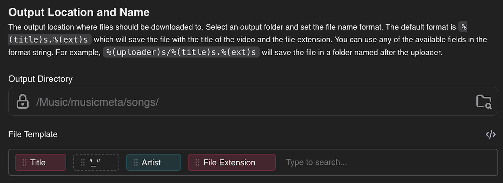
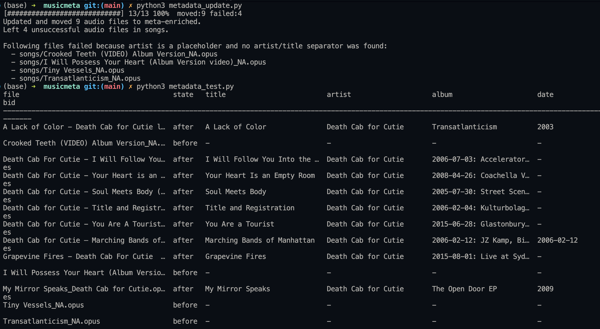

# musicmeta

`musicmeta` is a small workflow for getting off the apple music subscription or just updating your music's metadata.

1. Head to [Apple's Privacy Page](https://privacy.apple.com) and transfer a copy of your data to youtube music. You can now choose to stay on youtube music or continue:
2. Unlist your playlist on YouTube and download the playlist with [Stacher](https://stacher.io).
3. Save the downloaded audio files into `musicmeta/songs`.
4. Run `metadata_update.py`.
5. Use the enriched files from `musicmeta/meta-enriched` back into your music app for subscription free music.

The script updates your audio files with usable embedded metadata for media player apps such as Apple Music, iTunes, MusicBee, Plexamp, and similar libraries.

`songs/` is the intake folder. Put new downloads there.

`meta-enriched/` is the success folder. Files are moved here only after metadata is written successfully.

Files that fail parsing, tagging, or lookup stay in `songs/` so they can be fixed and rerun.

## Quick Start

Copy-paste the minimal steps below to get started.

1. Clone the repo:

```bash
git clone https://github.com/chaoticsponge/musicmeta
cd musicmeta
```

2. Install prerequisites:

```bash
# macOS / Linux
python3 --version
brew install ffmpeg   # or apt/yum as appropriate
python3 -m pip install requests
```

3. Install Stacher and set the filename template to `title_artist.ext`:

- https://stacher.io
- Set the filename template to: `title_artist.ext` (the underscore separates title and artist).



4. Put downloaded audio files into `songs/`.

5. Enrich metadata:

```bash
python3 metadata_update.py
```

6. If you want to inspect before/after metadata quickly:

```bash
python3 misc/metadata_test.py
```

Example test run:



7. Optional: move output elsewhere when running the updater:

```bash
python3 metadata_update.py --output /path/to/where/you/want/files
```

Supported formats: `.opus`, `.m4a`, `.mp3`, `.flac`, `.ogg`.

If you hit issues, files that failed tagging stay in `songs/` so you can fix filenames or retry.
